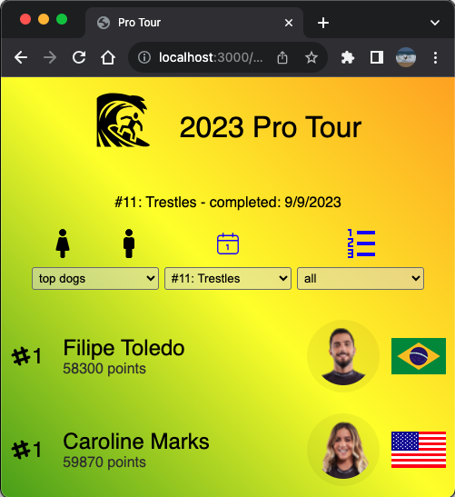
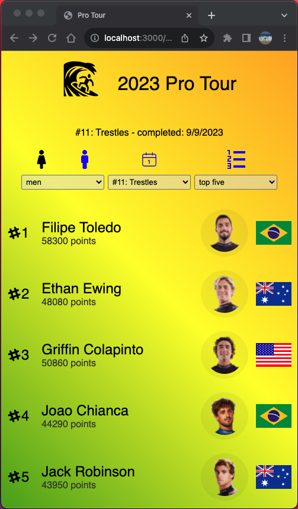
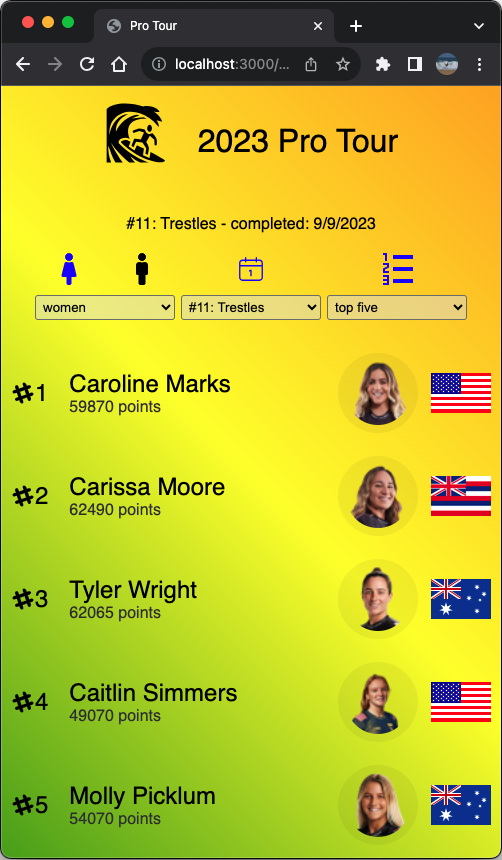

# ReactJS App

This project was:

- bootstrapped with [Create React App](./README/README-CREATE-REACT-APP.md)
- created with [App Setup](./README/README-SETUP.md)
- run in this [Environment](./README/README-ENV.md)

## Screen Shot

<p float="left">

</p>

<p float="left">


</p>

## Updates

- [x] created pro tour results list with four basic options

  - choose men or women
  - chose theme
  - choose how many: all, top 5, the ones poositioned to make the half-year cut, the ones who won't make the cut
  - rank event: rank event number one shows the ranking before the first event, there will be a new (reshuffled rankings) option for each completed event

- [x] created menu modal with content enabling changing of these options
- [x] created options menu, an alternative to the modal approach

  - use env var to toggle

- [x] added axios/cheerio screen scrape script to code

- [x] completed season - results in for all 11 contests

### set env var - tells app to show modal versus menu of options

committed .env file
set REACT_APP_SHOW_MENU false to archive the menu option for now

### run app

```shell
nvm use 18.0.0
npm i
npm run start
```

### scrape results - current standings/rankings

```shell
cd src/data/getData
node index.js
```

- [Results for contest ended 9/9/2023](./src/data/getData/surfers-2023-09-13T18%3A59%3A05.574Z.js)
